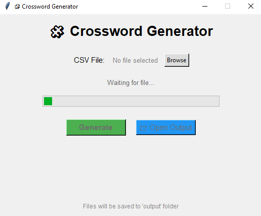
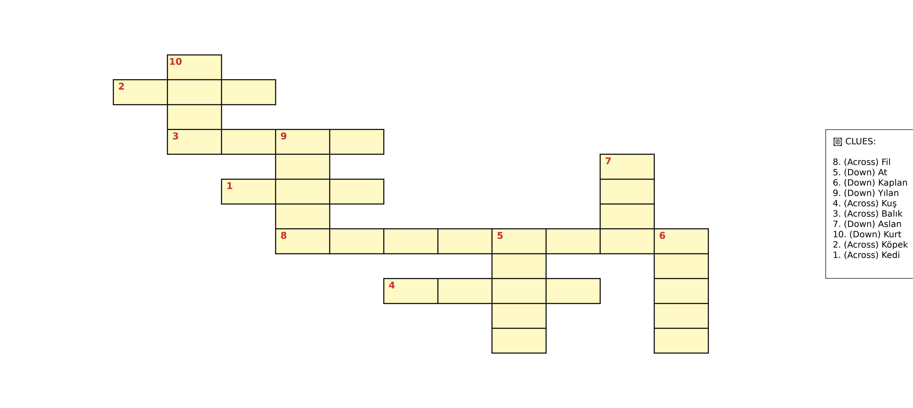
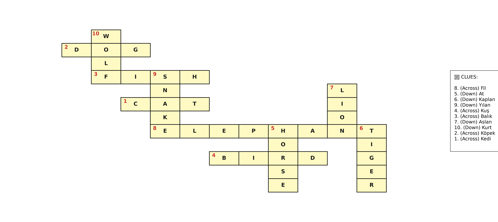

# 🧩 Crossword Generator (Python)

Generate professional crossword puzzles from a simple CSV file using a recursive backtracking algorithm.

Designed for teachers, language instructors, students, and anyone who wants to automatically create printable crossword worksheets with answer keys.

---

# 📸 Screenshots

## GUI



## Generated Puzzle

| Student Puzzle                                     | Answer Key                           |
| -------------------------------------------------- | ------------------------------------ |
|  |  |

---

# 👨‍💻 Developer

**Nazmanya**

📧 Email: [nazmanya@gmail.com](mailto:nazmanya@gmail.com)

🐙 GitHub: https://github.com/nazmanya

---

# ✨ Features

* 🧩 Automatic crossword generation
* 🔄 Recursive backtracking algorithm
* 🔍 Smart word intersection detection
* ↔️ Horizontal words are always placed **Left → Right**
* ↕️ Vertical words are always placed **Top → Bottom**
* 🚫 Words are never placed backwards
* ✅ Automatic validation of every placement
* 🔀 Automatic backtracking when a placement fails
* ✂️ Automatic puzzle cropping
* 📚 Supports large word lists
* 🌍 UTF-8 compatible (English, Turkish, and more)
* 🖥️ Tkinter graphical user interface
* 🖼️ High-resolution JPG export
* 📄 PDF export (Student Puzzle + Answer Key)
* 📝 TXT grid export for debugging
* 📂 Reads puzzles directly from CSV files
* 🔢 Automatic clue numbering

---

# 📂 Project Structure

```text
CrosswordGenerator/
│
├── images/
│   ├── gui.png
│   ├── student_crossword.jpg
│   └── answer_key.jpg
│
├── .gitignore
├── CHANGELOG.md
├── crossword.py
├── crossword_gui.py
├── LICENSE
├── README.md
├── requirements.txt
└── sample_words.csv
```

---

# 📥 Installation

Clone the repository:

```bash
git clone https://github.com/nazmanya/CrosswordGenerator.git
cd CrosswordGenerator
```

Install all required dependencies:

```bash
pip install -r requirements.txt
```

Or install only matplotlib:

```bash
pip install matplotlib
```

---

# ▶️ Usage

### Command Line

```bash
python crossword.py
```

### GUI

```bash
python crossword_gui.py
```

---

# 📄 CSV Format

The CSV file must contain the following columns:

| Column   | Description      |
| -------- | ---------------- |
| `sira`   | Question number  |
| `kelime` | Crossword answer |
| `ipucu`  | Crossword clue   |

Example:

```csv
sira,kelime,ipucu
1,ACCEPT,To agree to receive something
2,ENCOURAGE,To give confidence
3,EXPLAIN,To make something clear
4,WANDER,To walk without a clear destination
```

---

# 📤 Generated Files

The program automatically creates an **output/** folder.

Example output:

* `crossword_1.pdf`
* `student_crossword_1.jpg`
* `answer_key_1.jpg`
* `grid_output_1.txt`

Files are automatically numbered to prevent overwriting previous results.

---

# 🧠 Algorithm

The crossword is generated using a recursive backtracking algorithm.

## Workflow

1. Load all words from the CSV file.
2. Sort words by length.
3. Place the first word at the center of the grid.
4. Search for valid intersections.
5. Validate every candidate position.
6. Choose the position with the best intersection.
7. Backtrack when no valid placement exists.
8. Continue until all words are placed or no solution is possible.

---

# ✅ Crossword Rules

The generator follows standard crossword construction rules.

* Horizontal words are written **Left → Right**
* Vertical words are written **Top → Bottom**
* Words are never reversed
* Only identical letters may intersect
* Different letters cannot overlap
* Adjacent non-crossing letters are not allowed
* Every word (except the first) must intersect at least one existing word
* Invalid placements are automatically rejected

---

# 💻 Requirements

* Python 3.10+
* matplotlib

---

# 🚀 Roadmap

Future improvements may include:

* Multiple crossword layouts
* Symmetrical crossword generation
* Adjustable puzzle difficulty
* Export to SVG
* Export to DOCX
* Custom fonts
* Theme support
* Crossword statistics
* Density optimization
* Web version

---

# 🤝 Contributing

Contributions, ideas, feature requests, and bug reports are welcome.

Feel free to open an Issue or submit a Pull Request.

---

# 📜 License

This project is licensed under the **MIT License**.

You are free to use, modify, and distribute this software under the terms of the MIT License.

---

# ⭐ Support

If you found this project useful, please consider giving it a ⭐ on GitHub.

Your support helps the project grow and motivates future development.
